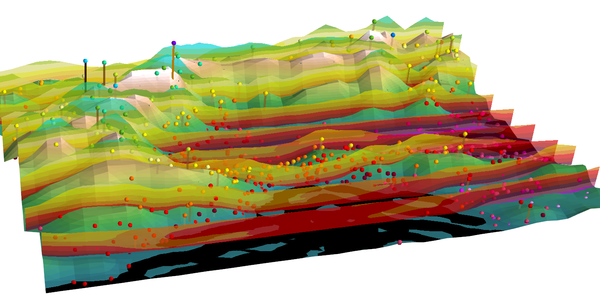
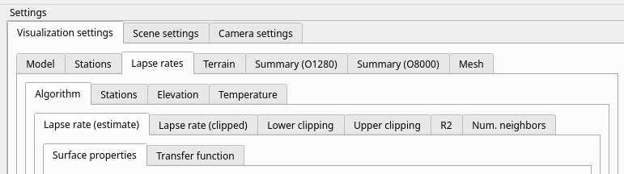
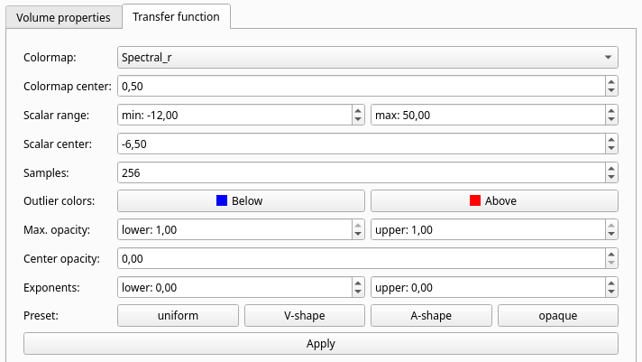
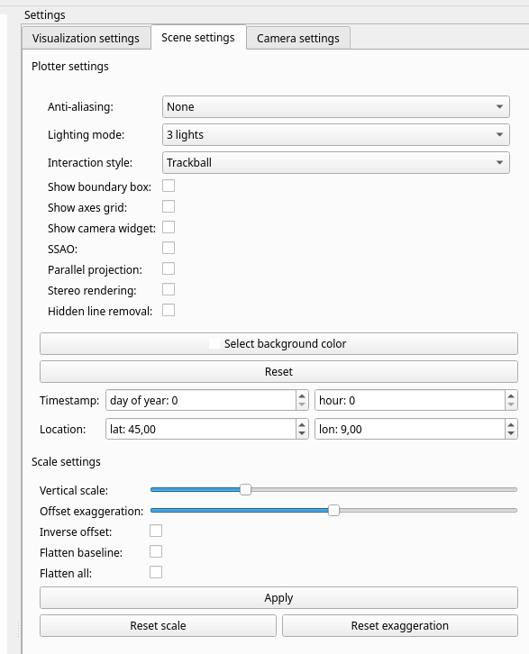

# Topographic Visualization of Near-Surface Temperatures for Improved Lapse Rate Estimation

Visualization of near-surface temperatures and lapse rates using VTK

[](https://doi.org/10.5281/zenodo.11550984) 



## Installation
```
conda create --name lapse_rates_vtk_new --solver=libmamba -c conda-forge python=3.10 xarray dask h5py netcdf4 zarr tqdm jupyterlab jupyterlab-lsp python-lsp-server eccodes cfgrib cartopy pyqt scikit-learn python-eccodes
pip install -r environment.txt
```

## Data cleansing
- run `src/observations/compute_point_predictions.py` to export station predictions for plain HRES and corrected HRES
- run `src/observations/compute_station_corrections.py` with various confidence settings to compute RANSAC corrected station predictions based on HRES
- run `src/observations/blacklist/build_mask.py` to export filter outputs and masked observations  

## Visualization tool

The visualization tool can be run by
- preprocessing observation data for visualization: `src/paper/export_data_for_visualization.py`
- preprocessing field data for visualization: `src/paper/export_preprocessed_data.py`
- running the script to launch the tool: `src/paper/volume_visualization/main.py  --data-dir path/to/data`

### Data preprocessing

The data directory should contain the following files, as generated by the preprocessing scripts:
- Station data: 
  - `station_data.parquet`
- Model data: 
  - `model_data_o1280.nc`
  - `model_data_o1280_safe.nc`
- Terrain data: 
  - `terrain_data_o1280.nc`
  - `terrain_data_o1280_safe.nc`
  - `terrain_data_o8000.nc`

All files contain data for a rectangular subregion (in latitude and longitude) of the northern hemisphere. 
Model data and terrain data are exported on the same domain, which is smaller that the domain on which the station data is exported. 
Data files marked with the suffix `safe` cover the same domain as the other files plus a safety margin of 0.5° on all sides to enable a more accurate computation of lapse rates at the domain boundaries. 
The main script that runs the tool contains a constant variable `USE_SAFETY_MARGINS` to toggle using the extended domain.

### Using the visualization tool

The visualization tool is controlled via a side menu with various visualization options that are grouped hierarchically:


The top level distinction toggles menus for the following groups of settings:
- **Visualization settings:** Visualization-specific settings that affect one visual actor at a time, such as visibility and appearance of different field actors
- **Scene settings:** Global scene parameters, such as scaling, lighting, interaction style and rendering methods
- **Camera settings:** Loading and saving camera settings and taking screenshots

#### Visualization settings

Visualizations are built by adding or removing actors from the scene. The tool operates on three types of actors:
- **Scalar actors:** Data items that assign scalar quantities to specific locations in space. The scalars are mapped to colors using a transfer function. The colors are used to paint the scene geometry. Transfer function parameters can be controlled per actor via a parametric settings interface. Scalar actors are defined on one of three geometry types:
  - Surface geometry (low-res or high-res orography): Surface data can be visualized as points, wireframe mesh or triangle surface
  - Volume geometry (model grid, volume summary grids): Volumes are visualized as isocontours, direct volume rendering (**slow!!!**) or wireframe mesh.
  - Station site geometry (station site, link between station site and low-res terrain)
  
  Transfer function parameters can be controlled separately per visual actor via a parametric interface:
  

- **Mesh actors**: Mesh actors represent the plain geometry. Similar visualization options apply as in the scalar case, but colors are used uniformly across the entire actor.

The visual actors are grouped according to their data content:
- **Model:** Surface and volume fields related to the model outputs:
  - T: volumetric temperature opn model levels
  - T2m: surface temperature on low-res orography
  - Gradients: vertical gradient of the volumetric temperature on model levels
  - Model levels: Elevation of the model levels encoded as a scalar on the model level grid
- **Stations:** Temperature-related variables at station sites:
  - Observations: temperature observations 
  - Predictions: 2m temperature from model outputs
  - Gradients: effective vertical gradient, computet as (Observation - Prediction) / (Station elevation - low-res terrain elevation)
  - T diff.: Difference between observation and prediction
- **Lapse rates:** Key quantities related to the lapse-rate-based downscaling with subgroups as follows:
  - Algorithm: Outputs of the lapse rate computation; raw and clipped lapse rates, local clipping thresholds, local R2 score, size of the local neighborhood.
  - Stations: corrected predictions with adaptive lapse rate, difference between adaptive prediction and observations, difference between adaptive prediction and raw model outputs.
  - Elevation: summary metrics related to elevation in the lapse rate computation
  - Temperature: summary metrics related to elevation in the lapse rate computation
- **Terrain:**: Elevation and orography-related quantities, visualized on low-res (O1280) and high-res (O8000) terrain surfaces.
- **Summary (O1280):** Terrain summary actors on low-res terrain
- **Summary (O8000):** Terrain summary actors on high-res terrain
- **Mesh:** Mesh actors for model level grid, low-res and high-res terrain, and station sites

Actors are added and removed from the scene by toggling the checkbox `show`. A global reset of the scene is possible via the `File` menu in the top left of the screen (Clear scene).

#### Scene settings

The scene settings menu offers options for plotter and scale settings.



Important options include:
- **Scaling settings:** Rescaling the vertical coordinate of the scene overal (Vertical scale) or relative to the low-res terrain altitude (offset exaggeration), invert relative elevation, flatten the baseline elevation or the scene overall (e.g., for map-like views)
- **Lighting:** `3 lights` and `LightKit` offer fixed scene light arrangements, enabling a comprehensive illumination of the scene. In the mode `Solar lighting`, the light position mimics the direction of solar irradiation on the location and date specified in the `Timestamp` and `Location` spinners. The sun is modeled as a parallel light source coming from a fixed elevation and azimuth. The lighting is not physically accurate due to the spatial extend of the scene and the effect of vertical rescaling. 

## Verification of lapse rate estimates and adaptive predictions

Adaptive temperature predictions at station sites can be computed and stored in `parquet` format with `src/observations/compute_adaptive_predictions.py`. A parallelized implementation is available in `src/observations/compute_adaptive_predictions_parallel.py`.

The generated prediction files can be used to compute scores with `src/observations/compute_score_analysis.py`. Histograms and trend plots of the outputs of ths script can be plotted with `src/observations/plot_score_analysis.py` and `src/observations/plot_score_histograms.py`.


